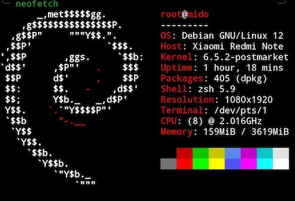
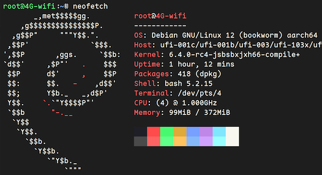
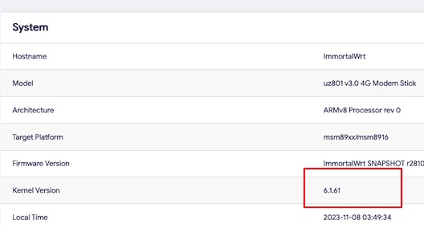

---
# https://vitepress.dev/reference/default-theme-home-page
layout: home

hero:
  name: "Phones Linux"
  text: ""
  tagline: 410/625/821/...等手机移植linux服务器
  actions:
    - theme: brand
      text: 手机
      link: /手机/
    - theme: alt
      text: 随身WiFi
      link: /随身wifi/
    - theme: alt
      text: openwrt
      link: /openwrt/

features:
  - icon: 📱
    title: 红米note4x(625)
    details: 
  - icon: 📶
    title: 随身wifi(410)
    details: 
  - icon: 📶
    title: openwrt(410)
    details: 
---
 

